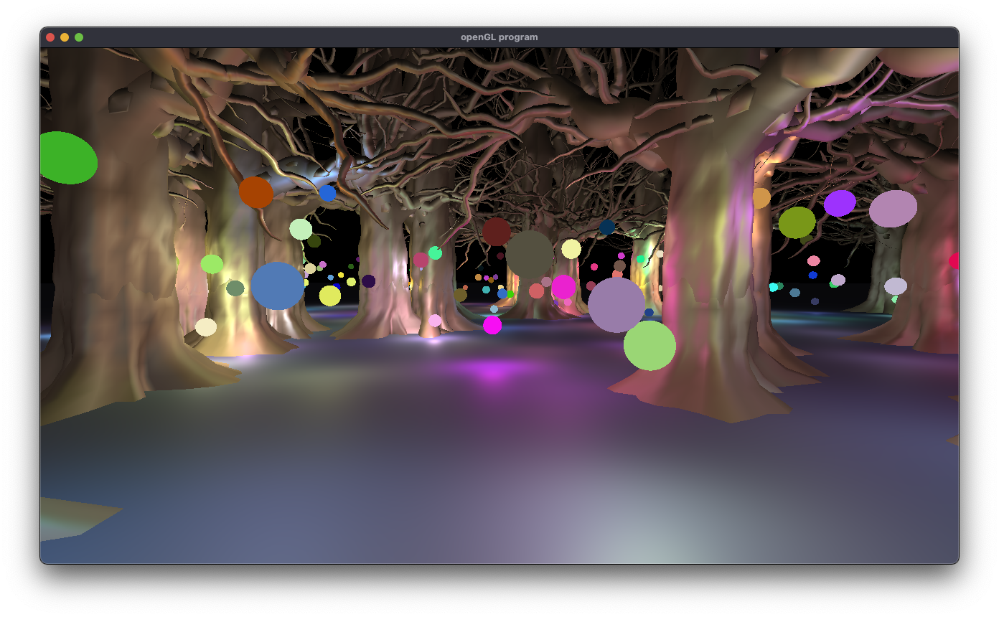
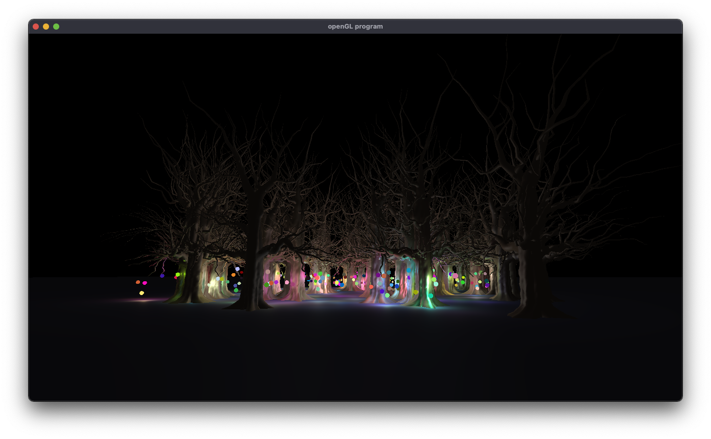
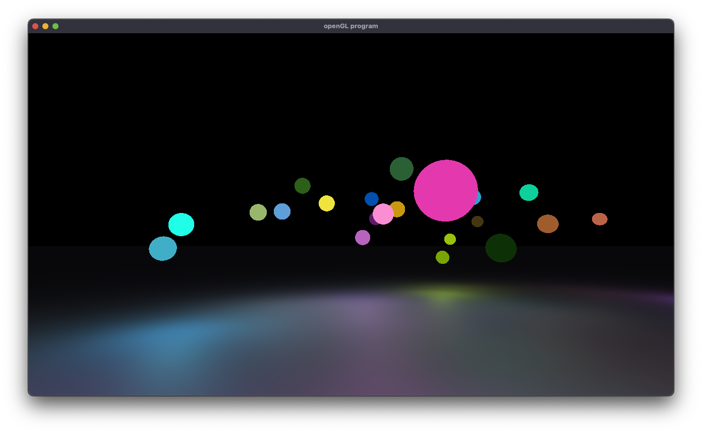

Forest of Light:
================

#### An exploration of deferred shading by Masood Kamandy

*Forest of Light* is a demo created for my final project in [Prof. Zoë Wood's](https://engineering.ucsb.edu/people/zo-wood) CS180 Introduction to Computer Graphics course at UC Santa Barbara. The goal of the project was to implement deferred shading to create a calming atmosphere that evoked "fireflies," though I pivoted away from fireflies after I saw the multicolored lights effect in the forest. It's fireflies, but in a far stranger and more science fiction kind of way.

Aside from the technology of deferred shading, this project is the culmination of my explorations of many different topics including: Blinn-Phong Illumination Model (including attenuation), Framebuffer Objects, Deferred Lighting, camera transforms, procedural model placement, bezier curves/splines and a smooth game camera.

Table of Contents
-----------------

1.  [Technologies Explored](#technolgies-explored)
    -   [Deferred Shading](#deferred-shading)
    -   [Framebuffer Objects](#framebuffer-objects)
    -   [Attenuation](#attenuation)

2.  [Controls](#controls)
3.  [Libraries](#libraries)
4.  [Platforms](#platforms)
5.  [How to Install](#how-to-install)
6.  [Credits and Contacts](#credits-and-contacts)

Technologies Explored
---------------------

There were several technologies that were key to my project that I explored on top of the core topics we learned in class for my final project.

#### Deferred Shading

The most crucial technology in my final project was deferred shading.

Deferred shading is a technique where lighting is applied in a separate pass that only takes into account light that affects the pixels on the screen. This is in contrast to forward shading, where all light is calculated every frame. The benefit of deferred shading is that many more lights can be displayed at acceptable framerates.

There are two major steps or *passes* that need to be implemented in deferred shading. That is the *geometry pass* and the *lighting pass*. In the geometry pass, geometry is calculated and then stored in 4 (3 in my implementation) separate textures in a framebuffer called the gBuffer. The gBuffer's 4 different textures are *position*, *normals*, *albedo*, and *specular*.

[Image Source](https://learnopengl.com/Advanced-Lighting/Deferred-Shading)

In *Forest of Light*, deferred shading afforded me the possibility of easily rendering 250 to 500 lights without any performance penalty.

The most crucial components, aside from establishing the render pipeline, are writing shaders for your geometry and lighting passes that take into account this new structure. With the geometry pass, our fragment shader does not write to the screen, but rather it writes to the gBuffer:

    #version 330 core
    layout (location = 0) out vec3 gPosition;
    layout (location = 1) out vec3 gNormal;
    layout (location = 2) out vec4 gAlbedoSpec;
    
    uniform sampler2D texture0;
    in vec2 texCoord;
    
    in vec3 fragPos;
    in vec3 fragNor;
    
    uniform vec3 MatAmb;
    uniform vec3 MatDif;
    
    void main()
    {
        // store the fragment position vector in the first gbuffer texture
        gPosition = fragPos;
        // also store the per-fragment normals into the gbuffer
        gNormal = normalize(fragNor);
        // and the diffuse per-fragment color
        gAlbedoSpec.rgb = MatDif;
        // store specular intensity in gAlbedoSpec's alpha component
        //constant could be from a texture
        gAlbedoSpec.a = 0.5;
    }

The lighting fragment shader was equally interesting in that you apply calculations using the data stored in the gBuffer. This is what makes deferred shading far less expensive than forward shading. If you are using a game camera, you need to also remember to apply the view transformations to the light positions:

    // Portions of this were adapted from instructions by Prof. Zoe Wood and
    // LearnOpenGL.com's Deferred Shading tutorial.
    
    #version 330 core
    
    in vec2 texCoord;
    out vec4 color;
    
    uniform sampler2D gPosition;
    uniform sampler2D gNormal;
    uniform sampler2D gColorSpec;
    
    const int NR_LIGHTS = 250;
    uniform vec3 lightPositions[NR_LIGHTS];
    uniform vec3 lightColors[NR_LIGHTS];
    
    uniform mat4 P;
    uniform mat4 V;
    uniform mat4 M;
    
    // You could make this into an array if you wanted different strength lights.
    float linear = -5.0;
    float quadratic = 15.0;
    
    uniform vec3 viewPos; // EPos from our labs. But here we set it as a uniform.
    
    void main(){
    
        // retrieve data from gbuffer
        vec3 FragPos = texture(gPosition, texCoord).rgb;
        vec3 Normal = texture(gNormal, texCoord).rgb;
        vec3 Diffuse = texture(gColorSpec, texCoord).rgb;
        float Specular = texture(gColorSpec, texCoord).a;
    
        // then calculate lighting as usual
        vec3 lighting  = Diffuse * 0.1; // hard-coded ambient component
        vec3 viewDir  = normalize(viewPos - FragPos);
    
        // the lights were off a bit, so I adjusted with a translation matrix for appearance.
        mat4 verticalShift = mat4(1.0, 0.0, 0.0, 0.0,  0.0, 1.0, 0.0, 0.0,  0.0, 0.0, 1.0, 0.0,  0.0, -0.75, 0.0, 1.0);
    
        for(int i = 0; i < NR_LIGHTS; ++i)
        {
            vec4 transformedLight = verticalShift * V * vec4(lightPositions[i], 1);
            
            // diffuse
            vec3 lightDir = normalize(transformedLight.xyz - FragPos);
            vec3 diffuse = max(dot(Normal, lightDir), 0.0) * Diffuse * lightColors[i];
    
            // specular
            vec3 halfwayDir = normalize(lightDir + viewDir);  
            float spec = pow(max(dot(Normal, halfwayDir), 0.0), 16.0);
            vec3 specular = lightColors[i] * spec * Specular;
    
            // attenuation
            float distance = length(transformedLight.xyz - FragPos);
            float attenuation = 1.0 / (1.0 + linear * distance + quadratic * distance * distance);
            diffuse *= attenuation;
            specular *= attenuation;
            lighting += diffuse + specular;        
        }
    
        color = vec4(lighting, 1.0);
    
    }

I experienced many difficulties in implementing a deferred shading pipeline, most of which had to do with properly understanding the state of the graphics card and the correct commands to create the framebuffer. The concept was fairly straightforward to understand, but implementing it properly was a challenge. Thankfully there were many support materials I was able to use to complete the project, including assistance and handouts by Prof. Wood. Another solution was just *getting organized and staying organized* and *dividing everything up into the smallest steps I could*.

**References:**

-   [LearnOpenGL – Deferred Shading](https://learnopengl.com/Advanced-Lighting/Deferred-Shading)
-   [Real-Time Rendering, 4th Edition, by Tomas Akenine-Möller, Eric Haines, Naty Hoffman, Angelo Pesce, Michał Iwanicki, and Sébastien Hillaire](https://www.realtimerendering.com/)

#### Framebuffer Objects

A framebuffer object allows a graphics programmer to store the result of a render pass somewhere other than the default framebuffer. This concept ended up being very important to my project.

For the purpose of my project, the crucial part that required me to implement a framebuffer was the gBuffer itself. I also needed to manipulate framebuffers to draw with a bit of forward rendering after the deferred shading was complete. I needed to do this for the actual light portin of my spheres to appear as if they were lit.

The process to do this was to copy the result of the deferred shading depth buffer into the default framebuffer's depth buffer.

The code to do this utilize's OpenGL's `glBlitFramebuffer` to copy from one buffer to another. This process is thankfully described in many resources on the web:

    glBindFramebuffer(GL_READ_FRAMEBUFFER, gBuffer);
    glBindFramebuffer(GL_DRAW_FRAMEBUFFER, 0); // write to default framebuffer
    glBlitFramebuffer(
        0, 0, SCR_WIDTH, SCR_HEIGHT, 0, 0, SCR_WIDTH, SCR_HEIGHT, GL_DEPTH_BUFFER_BIT, GL_NEAREST
    );
    glBindFramebuffer(GL_FRAMEBUFFER, 0);

Moving forward I believe this method could be used to also draw a skybox. My intention originally was to draw with a skybox, but the traditional forward rendering method of creating a skybox wasn't working. Although I ended up loving the look of the black sky and the stark light, I would like to explore using this copying of the depth buffer to create a skybox in programs using a deferred shading pipeline.

**References:**

-   [LearnOpenGL – Deferred Shading](https://learnopengl.com/Advanced-Lighting/Deferred-Shading)

#### Attenuation

In my attempt to create a firefly-like experience that was solely lit by floating orbs I explored many different approaches. One approach was to mask everything and to only light areas within a radius of each point light. It was an unexpected delight to find that *attenuation*, which we never implemented in our coursework, was actually exactly what I needed and gave me a great deal of control over the fall off of the light (see lighting pass fragment shader above).

In my continued work with computer graphics, I intend to implement sliders to explore parameters like this. For this project, I just recompiled the shaders by running many, many times until I understood the effect of various attenuation values. A slider would have saved a lot of time.

The attenuation I ended up using was a linear value of -5.0 and a quadratic of 15.0.

**Reference:**

-   [Blinn–Phong reflection model](https://en.wikipedia.org/wiki/Blinn%E2%80%93Phong_reflection_model)
-   [Learn OpenGL - Deferred Shading](https://learnopengl.com/Advanced-Lighting/Deferred-Shading")

Controls
--------

-   W, A, S, D: moves forward and back, strafes left and right
-   Z: Show wireframe
-   Trackpad: Look around

Libraries
---------

-   GLFW
-   GLM
-   GLAD
-   tinyobjloader

Platforms
---------

-   Windows
-   Linux
-   Mac

How to Install
--------------

[Github Repository](https://github.com/masoodkamandy/CS180-Final-Fireflies)

This project uses the CMake to generate the development environment. In order to get the project running your machine you need to install the CMake and download the project.

After that, you need to create a build folder inside the project. Then you can build the project with the CMake. This has been testec on MacOS, but the CMakeLists.txt file and all libraries are cross-platform so it should work on Linux, MacOS, and Windows.

    #MacOS commands
    $ cd forest-of-light
    $ mkdir build
    $ cd build
    $ cmake ..
    $ make
    $ ./defer

Credits and Contacts
--------------------

-   Masood Kamandy ([masood@masoodkamandy.com](mailto:masood@masoodkamandy.com)): Software Engineer/Artist
-   Tree Model by Unixium ([CGTrader Broadleaf - Hero field Free 3D model](https://www.cgtrader.com/free-3d-models/plant/other/broadleaf-hero-field))

© Copyright 2021 Masood Kamandy. All rights reserved. Project completed June 9, 2021.